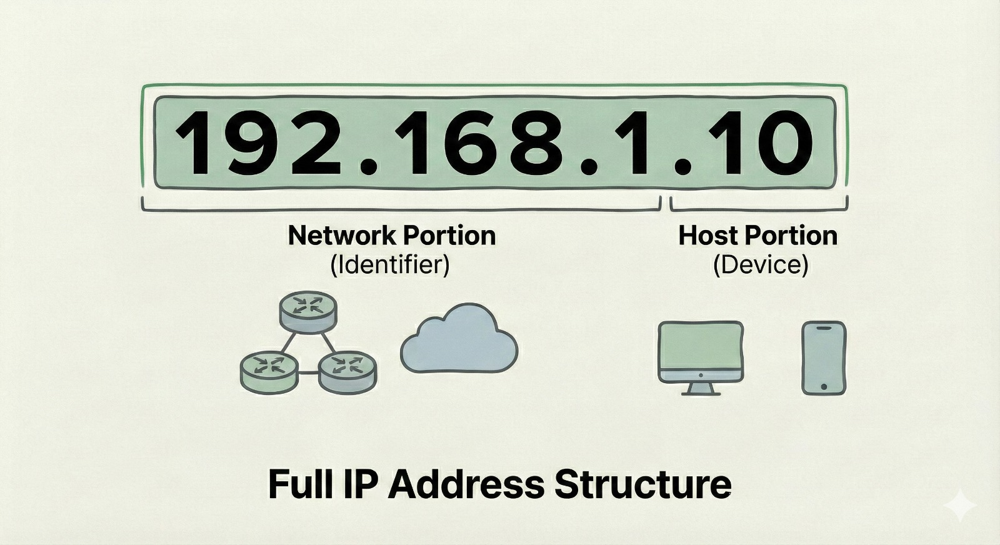

## Introduction
To break a network, We must first understand how it is built. In this post, I am exploring some very first important concepts of networking, but as a Red Teamer perspective.

## IP Addressing & Subnetting
No network can exist without IP address and subnet masks, and that is why is the one of the most important networking topics to learn to become a master in red teaming.

As an aspiring Red Teamer, I realized that I can't just run tools blindly. I need to understand the network I'm attacking. If I don't know the difference between a `/24` and a `/23`, I might end up attacking the wrong target or would miss the target, or even worst target the network for which i am not autorised. Causing a law suit agains't me.


## IP ADDRESSING

* **What is an IP Address :** An IP address is a unique 32 bit number assigned to every device on the netowrk, be it small network or a huge network which uses internet protocol for communication.

  * **Example :** 172.217.19.164 (Google.com)

* **The Anatomy Of An IP Address :**  An IP Address is build wth two portions.
  * **Network Portion :** This portion are the initial bits of the IP address which helps the router to reoute traffic to correct network. This portion also helps to identify the network a device belongs to. This is like a street for traffic that helps which street to go to find the reciver of that traffic.

    

  * **Host Portion :** This portion is the host portion which tells the traffic where exactly it is at that street(Network Portion). These are the very last bits of an IP Address.

    

* **Attack :** If I can physically touch the server, I own it. (e.g., Plugging in a Rubber Ducky USB).

### Layer 3: Network
* **Concept:** Routing and IP addresses.
* **Attack:** This is where we perform reconnaissance using tools like `ping` to see if a host is alive.

## The Code: Python Ping Scanner
We don't need complex tools to interact with Layer 3. Here is a simple Python script I wrote to check for active hosts:

```python
import os
import platform

# Check if we are on Windows or Linux to choose the correct ping flag
param = '-n' if platform.system().lower() == 'windows' else '-c'
hostname = "google.com"

# The command will now work on both your Windows PC and Linux servers
response = os.system(f"ping {param} 1 {hostname}")

if response == 0:
  print(f"{hostname} is up!")
else:
  print(f"{hostname} is down!")
```